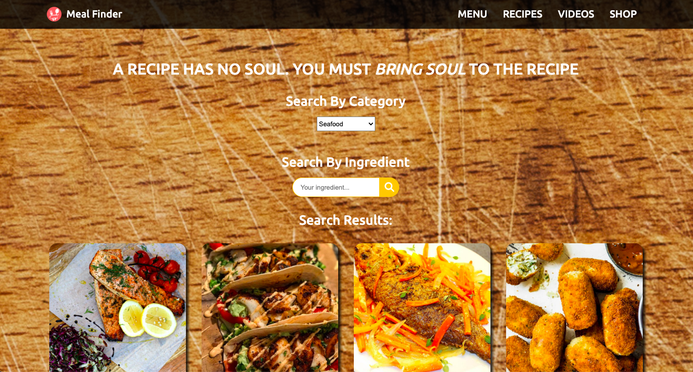

# Meal Finder - [Demo](https://srdrolmez.github.io/Meal-API-Project/src){:target="_blank"}

## Description

Meal finder depends on TheMealDB API which allows you to search meal by category or by ingredient. Each meal has instructions and a video link shows how to cook. Discover the cook in you !

## Interact with SPA

- You can display meals by selecting a category between 14 categories.

- You can also search meals by ingredients. Write the ingredient you have and display results by ingredient.

- You can see the cooking instructions and watch a video shows how to cook.
